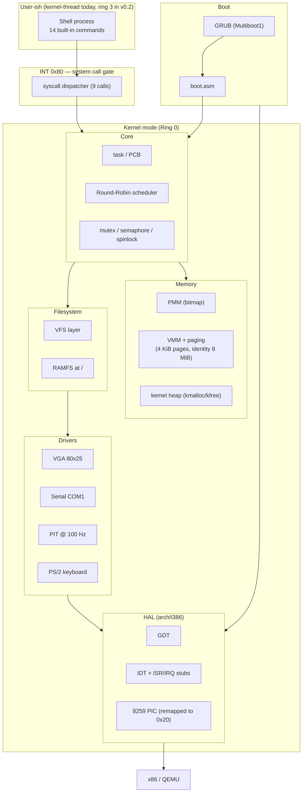

<div align="center">

# HelixOS

**A 32-bit educational microkernel for x86, written from scratch in C and NASM.**

[](https://github.com/prakhardewangan2005-hash/helix-os/actions/workflows/ci.yml)
[](https://github.com/prakhardewangan2005-hash/helix-os/actions/workflows/lint.yml)
[](https://en.wikipedia.org/wiki/C11_(C_standard_revision))
[](https://www.nasm.us/)
[](https://en.wikipedia.org/wiki/I386)
[](LICENSE)
[](https://www.gnu.org/software/make/)

HelixOS boots in QEMU, identity-maps low memory under 4 KiB paging, catches every CPU exception with full register dumps, preemptively schedules kernel threads over a Round-Robin policy, exposes a 9-call syscall ABI via `INT 0x80`, mounts a hierarchical in-memory filesystem, and drops you into an interactive shell with 14 built-in commands — in under 30 KB of compiled `.text`.

</div>

---

## Demo

<table>
<tr>
<td width="50%">

**Boot screen**

The full init chain from GRUB hand-off through GDT, IDT, PIC remap, paging, heap, scheduler, and shell spawn. Each subsystem reports green when ready.

</td>
<td width="50%">

**Interactive shell**

`ls` walks the VFS tree (blue directories, files with sizes). `ps` enumerates tasks. `mem` reports heap and physical-frame stats. All command output is routed through real `INT 0x80` syscalls.

</td>
</tr>
<tr>
<td></td>
<td></td>
</tr>
</table>

---

## Highlights

- **Boots on real hardware and in QEMU** via Multiboot1 (GRUB) — no special tooling needed
- **Real 32-bit paging** with a page-fault handler that decodes CR2 + error code
- **Preemptive Round-Robin scheduler** driven by the PIT at 100 Hz
- **IRQ-driven drivers** for VGA, serial (COM1), PIT, and PS/2 keyboard
- **First-fit kernel heap** with split + coalesce, validated by an 8-block stress test on every boot
- **`INT 0x80` syscall layer** with 9 calls (write, read, exit, getpid, yield, sleep, uptime, ps, meminfo)
- **VFS + RAMFS** mounted at `/` with hierarchical directories and growable files
- **Interactive shell** with 14 commands including `ls`, `cat`, `touch`, `mkdir`, `write`, `ps`, `mem`, `uptime`, `reboot`
- **Built clean** under `-Wall -Wextra -Werror -O2` with no warnings
- **CI-ready** — `make`, `make iso`, `make run`, `make test`, `make lint`, `make format`

---

## Quick start

Requires Linux or macOS with Homebrew/apt. The build script bootstraps the cross-compiler the first time.

```bash
git clone https://github.com/prakhardewangan2005-hash/helix-os.git
cd helix-os

# One-time toolchain build (~10 min, only needed once)
./scripts/build-toolchain.sh ~/opt/cross
export PATH="$HOME/opt/cross/bin:$PATH"

# Build and boot
make iso         # produces build/helix.iso
make run         # opens QEMU window, drops to shell prompt
```

Prefer Docker?

```bash
docker build -t helix-dev -f docker/Dockerfile .
docker run --rm -it -v $(pwd):/helix helix-dev make run
```

Detailed instructions live in [`docs/setup.md`](docs/setup.md).

---

## Architecture



More: [`docs/architecture/overview.md`](docs/architecture/overview.md).

---

## Repository layout

```
helix-os/
├── src/
│   ├── boot/           Multiboot entry + linker script
│   ├── kernel/         kmain, panic, version
│   ├── arch/i386/      GDT, IDT, ISRs, IRQs, PIC, port I/O
│   ├── memory/         PMM, paging, VMM, heap
│   ├── process/        task, scheduler, context switch, sync
│   ├── syscalls/       INT 0x80 gate + dispatch table
│   ├── drivers/        vga, serial, timer, keyboard
│   ├── fs/             vfs, ramfs
│   ├── shell/          interactive shell + 14 commands
│   └── lib/            freestanding subset of libc
├── include/helix/      kernel-wide headers (types, kernel, version)
├── docs/               architecture, ADRs, API ref, diagrams
├── scripts/            toolchain bootstrap, QEMU launchers
├── docker/             dev container
├── tests/              host-side unit + integration tests
├── grub/grub.cfg       boot menu
└── Makefile            one-stop build/run/test/lint
```

Full per-directory rationale: [`docs/modules.md`](docs/modules.md).

---

## Subsystem deep-dives

| Subsystem | Docs |
|---|---|
| Boot sequence (GRUB → `_start` → `kmain` → init order) | [`boot-sequence.md`](docs/architecture/boot-sequence.md) |
| Memory model (PMM → paging → VMM → heap) | [`memory-model.md`](docs/architecture/memory-model.md) |
| Interrupt handling (IDT, ISR vs IRQ, 8259 PIC) | [`interrupt-handling.md`](docs/architecture/interrupt-handling.md) |
| Scheduler design (Round Robin, context switch, sync) | [`scheduler-design.md`](docs/architecture/scheduler-design.md) |
| System call ABI | [`api/syscalls.md`](docs/api/syscalls.md) |

---

## Roadmap

What ships in v0.1 (current):

> ✅ Multiboot1 boot, GDT/IDT, paging, kernel heap, drivers, scheduler, syscalls, VFS, RAMFS, shell

Deferred to v0.2+:

- **User mode** (ring 3 process isolation) and `fork`/`exec`
- **ELF loader** so userspace binaries can ship as separate files
- **SMP** — currently single-CPU only
- **x86_64 long mode** port
- **Network stack** — at least loopback and a minimal driver
- **Persistent on-disk filesystem** (FAT16 or custom)

See [`ROADMAP.md`](ROADMAP.md) for the full plan with target milestones.

---

## Learning objectives

This project demonstrates working knowledge of:

| Area | What HelixOS exercises |
|---|---|
| **Hardware** | x86 boot protocol, GDT/IDT, segmentation, paging, port I/O, 8259 PIC, PIT, PS/2 |
| **Operating-system theory** | Privilege rings, virtual memory, preemptive scheduling, IPC primitives, system calls, virtual filesystems |
| **Systems programming** | Freestanding C, inline assembly, linker scripts, memory layout, ABI boundaries, race conditions |
| **Engineering practice** | Static analysis, CI, conventional commits, ADRs, reproducible builds, semantic versioning |

---

## Building from source — what `make` does

| Target | Effect |
|---|---|
| `make` | Cross-compile every `.c` → `.o`, assemble every `.asm` → `.o`, link with `src/boot/linker.ld` → `build/helix.bin` |
| `make iso` | Wrap `helix.bin` + `grub.cfg` into a GRUB-bootable ISO |
| `make run` | Build the ISO if needed and boot it under QEMU with serial redirected to stdio |
| `make debug` | Boot with QEMU paused at entry, GDB server listening on `:1234` |
| `make clean` | Remove `build/` |
| `make format` | Run `clang-format -i` on all C sources |
| `make lint` | Run `cppcheck` static analysis |
| `make test` | Run host-side unit tests under `tests/unit/` |

---

## Contributing

PRs welcome. Read [`CONTRIBUTING.md`](CONTRIBUTING.md) first — it covers branch naming, commit format (Conventional Commits), code style (clang-format), and the PR checklist.

By contributing you agree to the [Code of Conduct](CODE_OF_CONDUCT.md).

Security-sensitive issues: see [`SECURITY.md`](SECURITY.md) for the responsible-disclosure flow.

---

## Acknowledgements

This project draws on the [OSDev Wiki](https://wiki.osdev.org/), James Molloy's "Roll your own toy UNIX-clone OS" tutorial, the MIT 6.828 (xv6) sources, and Philipp Oppermann's `blog_os` for cross-pollination with the Rust OS-dev community.

Code is original; the architectural patterns are common knowledge in the field.

---

## License

MIT — see [LICENSE](LICENSE). You can fork, ship, or commercialize freely; the only requirement is keeping the copyright notice.
