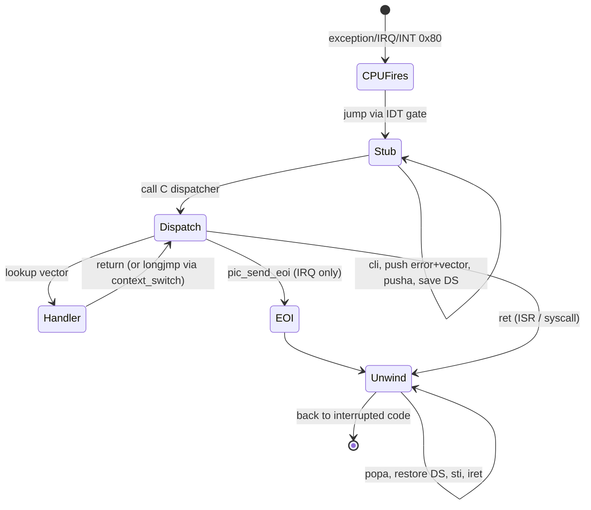

# Interrupt Handling

Every interaction the kernel has with hardware — every keystroke, every timer tick, every divide-by-zero — flows through the interrupt subsystem. This document explains the four layers involved.

## The four layers

```
┌─────────────────────────────────────────────────┐
│  C handler (registered by driver / VMM / etc.)  │  isr_register(N, fn) / irq_register(N, fn)
├─────────────────────────────────────────────────┤
│  C dispatcher (one for ISR, one for IRQ)        │  isr_dispatch / irq_dispatch
├─────────────────────────────────────────────────┤
│  ASM trampolines (32 ISRs + 16 IRQs + syscall)  │  isr_stubs.asm, irq_stubs.asm
├─────────────────────────────────────────────────┤
│  IDT (gate table loaded with LIDT)              │  idt.c
└─────────────────────────────────────────────────┘
            ↑
        CPU / 8259 PIC
```

Plus the GDT, which is referenced from every gate via the code-segment selector.

## GDT

[`src/arch/i386/gdt.c`](../../src/arch/i386/gdt.c)

Five entries, all using a flat 4 GiB span:

| Index | Selector | Access byte | Purpose |
|---|---|---|---|
| 0 | 0x00 | 0x00 | null (required by hardware) |
| 1 | 0x08 | 0x9A | kernel code (ring 0, executable, readable) |
| 2 | 0x10 | 0x92 | kernel data (ring 0, writable) |
| 3 | 0x18 | 0xFA | user code (ring 3, executable, readable) |
| 4 | 0x20 | 0xF2 | user data (ring 3, writable) |

The user selectors are present even though v0.1 never switches to ring 3 — they're there for the v0.2 user-mode work, and keeping them in the GDT now means we don't have to re-flush segment registers later.

### Reloading segment registers

`lgdt` loads the GDT register but the CPU keeps the *cached* segment descriptors in shadow registers. You must reload every segment. `gdt_flush` in [`gdt_flush.asm`](../../src/arch/i386/gdt_flush.asm) does:

```nasm
mov ax, 0x10                ; kernel data
mov ds, ax
mov es, ax
mov fs, ax
mov gs, ax
mov ss, ax
jmp 0x08:.reload_cs         ; only a far jump can reload CS
```

That far jump is why we need a labeled fall-through target.

## IDT

[`src/arch/i386/idt.c`](../../src/arch/i386/idt.c)

256 gates, allocated as a `static idt_entry_t idt[256]`. Each gate is 8 bytes:

```c
struct PACKED idt_entry {
    uint16_t offset_low;     // bits 15..0 of handler address
    uint16_t selector;       // 0x08 = kernel code
    uint8_t  zero;           // must be 0
    uint8_t  type_attr;      // P | DPL | type
    uint16_t offset_high;    // bits 31..16
};
```

The `type_attr` byte:

```
bit 7   Present
bit 6,5 DPL (descriptor privilege level)
bit 4   0
bit 3,2,1,0  Gate type:
        0xE  32-bit interrupt gate (we use this)
        0xF  32-bit trap gate (no IF clear)
```

Gates we install:

| Vector | Source | Handler | DPL |
|---|---|---|---|
| 0..31 | CPU exceptions | `isr0`..`isr31` (asm stubs) | 0 |
| 32..47 | Hardware IRQs (after PIC remap) | `irq0`..`irq15` | 0 |
| 0x80 | `INT 0x80` system call | `syscall_entry` | 3 (user-reachable) |

All other vectors (48..127, 0x81..0xFF) have their Present bit clear → any IRQ to them raises a General Protection fault, which catches misconfiguration loudly.

## ISR — CPU exceptions

The CPU pushes a frame onto the kernel stack when an exception fires:

```
   [low addr] EIP       ← pushed first
              CS
              EFLAGS
   [high]     (error code, only for vectors 8, 10..14, 17, 21)
```

Then it jumps to the handler in the IDT gate.

### The stubs

Hand-writing 32 stubs would be silly — `isr_stubs.asm` uses NASM macros:

```nasm
%macro ISR_NOERR 1
global isr%1
isr%1:
    cli
    push  dword 0                 ; dummy error code
    push  dword %1                ; interrupt number
    jmp   isr_common
%endmacro

%macro ISR_ERR 1
global isr%1
isr%1:
    cli
                                  ; CPU already pushed error code
    push  dword %1
    jmp   isr_common
%endmacro
```

Then 32 invocations:

```nasm
ISR_NOERR 0     ; Divide-by-zero
ISR_NOERR 1     ; Debug
ISR_NOERR 2     ; NMI
...
ISR_ERR   8     ; Double fault
...
ISR_ERR   14    ; Page fault
...
```

Each stub leaves the stack in a uniform shape: `int_no, err_code, EIP, CS, EFLAGS, [USERESP, SS]`. The common path then `pusha` to save GPRs, pushes DS, switches to kernel data segments, and calls the C dispatcher.

### `registers_t`

The stub leaves on the stack exactly the layout described by `registers_t`:

```c
typedef struct {
    uint32_t ds;
    uint32_t edi, esi, ebp, esp_dummy, ebx, edx, ecx, eax;
    uint32_t int_no, err_code;
    uint32_t eip, cs, eflags, useresp, ss;
} registers_t;
```

`isr_common` calls `isr_dispatch(esp)` — the dispatcher sees the frame as a `registers_t *` and can both read and (in the syscall case) write fields.

### `isr_dispatch`

A 12-line function that looks up `regs->int_no` in a 32-entry handler table and calls it. The default handler dumps every register and panics.

```c
static const char *exception_names[32] = {
    "Divide-by-zero", "Debug", "Non-maskable interrupt",
    "Breakpoint", "Overflow", ...
};
```

Drivers (or the VMM) override entries with `isr_register(vector, handler)`.

## IRQ — hardware interrupts

Identical pattern, structurally simpler because there's never a CPU-pushed error code. `IRQ_STUB 0, 32` produces a stub for IRQ line 0 mapped to interrupt vector 32.

### The 8259 PIC

The legacy x86 has two cascaded 8259 chips, master and slave. By default they raise vectors 0x08..0x0F (master) and 0x70..0x77 (slave). **Those overlap CPU exceptions.** We remap them via the canonical ICW1..ICW4 sequence in [`pic.c`](../../src/arch/i386/pic.c):

| ICW | Master | Slave | Meaning |
|---|---|---|---|
| ICW1 | 0x11 | 0x11 | "starting init, expect 4 ICWs, cascaded, edge-triggered" |
| ICW2 | 0x20 | 0x28 | new vector base (master→0x20, slave→0x28) |
| ICW3 | 0x04 | 0x02 | master: bitmap of slave wiring (slave on IRQ 2 → bit 2). Slave: its ID (2). |
| ICW4 | 0x01 | 0x01 | 8086 mode, normal EOI |

After remap, IRQ 0 fires INT 0x20 (32), IRQ 1 fires INT 0x21 (33), ..., IRQ 15 fires INT 0x2F (47).

### Masking

Each PIC has an Interrupt Mask Register (IMR). `pic_mask(N) / pic_unmask(N)` write the mask byte via port 0x21 (master) or 0xA1 (slave). On boot, `pic_init` masks **everything** — drivers explicitly unmask their own line when they're ready to receive.

### End-of-Interrupt (EOI)

The PIC tracks an "in service" register. Until we send EOI, it refuses to deliver any IRQ of equal or lower priority. The priority order on master PIC is hard-wired: IRQ 0 (timer) > IRQ 1 (keyboard) > IRQ 2 (cascade) > ...

```c
void pic_send_eoi(uint8_t irq) {
    if (irq >= 8)
        outb(0xA0, 0x20);       // ack slave
    outb(0x20, 0x20);           // always ack master
}
```

### EOI timing — the bug that bit us

The naive implementation is to EOI **after** the handler runs:

```c
void irq_dispatch(registers_t *r) {
    handlers[r->int_no - 32](r);
    pic_send_eoi(r->int_no - 32);   // ← too late
}
```

This breaks in HelixOS because the PIT handler calls `scheduler_tick → schedule → context_switch`. The switch *leaves the current IRQ frame on the old task's stack*. When the new task starts running with interrupts re-enabled, the PIC still thinks IRQ 0 is in service. Result: IRQ 1 (keyboard) is silently blocked.

The fix — EOI **before** the handler runs:

```c
void irq_dispatch(registers_t *r) {
    uint8_t irq = r->int_no - 32;
    pic_send_eoi(irq);              // ← BEFORE
    if (irq < 16 && handlers[irq])
        handlers[irq](r);
}
```

Safe because the stub still holds `cli`. The PIC is acknowledged, but the CPU's IF is still cleared, so no recursive IRQ delivery happens.

This is documented as [ADR-005](../design/adr/0005-eoi-before-handler.md).

## System call (INT 0x80)

The third use of the IDT. Vector 0x80 is installed at DPL=3 so future ring-3 code can call it. The stub in [`syscall_dispatch.asm`](../../src/syscalls/syscall_dispatch.asm) is structurally identical to the IRQ stubs but doesn't go through the PIC (it's a software interrupt — no EOI).

The C side:

```c
void syscall_dispatch(registers_t *r) {
    uint32_t n = r->eax;
    if (n >= SYS_MAX || !syscall_table[n]) {
        r->eax = -1;
        return;
    }
    r->eax = syscall_table[n](r);
}
```

The return value is written into the saved EAX slot of the frame. When the stub's `popa` runs, EAX gets restored from that slot — so the caller sees it as the syscall return value. Slick.

See [`api/syscalls.md`](../api/syscalls.md) for the call table.

## State diagram — what happens on every interrupt



For exceptions/syscalls the EOI step is skipped. For preempting IRQs (PIT), the "Unwind" step happens on a *different task's stack* — but the eventual `iret` is what re-enters the interrupted task.
