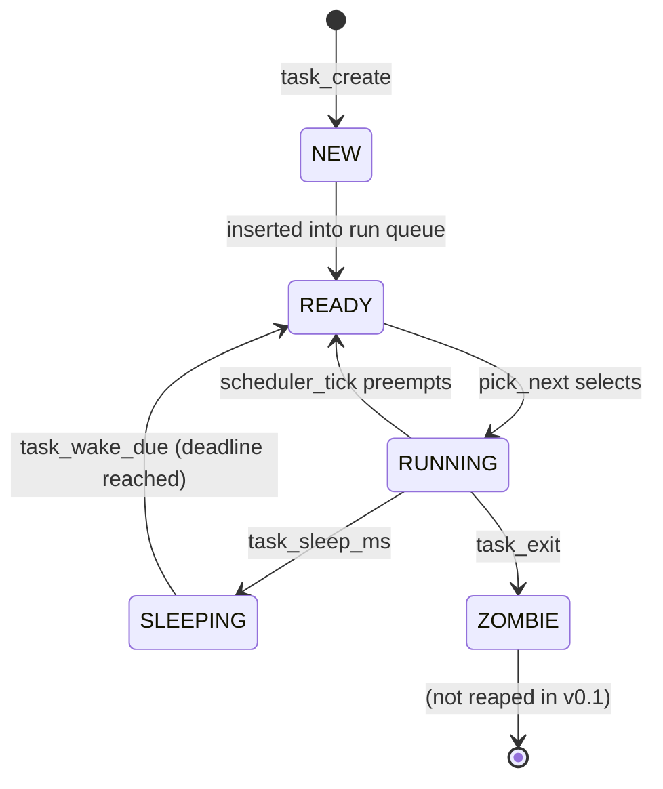

# Scheduler Design

## Goal

Run multiple kernel threads on a single CPU such that:

- Each thread eventually runs (no starvation)
- A thread that sleeps releases the CPU
- A thread that blocks waiting for input doesn't waste cycles
- Switching is cheap (< 100 cycles)

## Algorithm

**Preemptive Round Robin**, driven by the PIT at 100 Hz. Each task gets the CPU for one tick (10 ms), then the PIT IRQ forces a re-schedule.

Task picker (`pick_next` in [`scheduler.c`](../../src/process/scheduler.c)):

```
walk forward from current->next:
    if task.state == READY: return it
walk wraps around to current:
    if current can still run (RUNNING or READY): return current
otherwise:
    sti; hlt; cli  (wait for an IRQ to wake someone)
    retry
```

The list is a circular doubly-linked all-tasks list — so "forward from current" naturally gives Round-Robin fairness.

## Task lifecycle



In v0.1 zombies remain in the list — they don't consume CPU because `pick_next` skips them, and there's no reaper because no one is waiting (`waitpid` is a v0.2 thing).

## The PCB

```c
typedef struct task {
    uint32_t       esp;            // saved kernel stack pointer
    uint32_t       pid;
    char           name[32];
    task_state_t   state;
    void          *stack;          // base addr (for kfree on exit)
    uint32_t       wake_tick;      // SLEEPING deadline in PIT ticks
    struct task   *next, *prev;    // circular list
} task_t;
```

40 bytes flat. Each task also owns an 8 KiB stack allocated by `kmalloc` — large enough for kernel call chains, small enough that we can have hundreds of tasks before the heap is exhausted.

The init task (pid 0) is special: its PCB is a static global (`init_task` in `task.c`), its "stack" is the boot stack from `boot.asm`, and it's installed by `task_init` rather than `task_create`. This is the only task whose stack isn't on the heap.

## Context switch

The most delicate part. [`context_switch.asm`](../../src/process/context_switch.asm) takes two arguments — a pointer to where to save the current task's ESP, and the next task's ESP value:

```nasm
context_switch:
    push  ebp
    push  ebx
    push  esi
    push  edi
    pushfd                        ; save EFLAGS last → on top of frame

    mov   eax, [esp + 24]         ; old_esp_ptr
    mov   [eax], esp              ; *old_esp_ptr = ESP

    mov   esp, [esp + 28]         ; ESP = new_esp

    popfd                         ; restore EFLAGS (incl. IF)
    pop   edi
    pop   esi
    pop   ebx
    pop   ebp
    ret                           ; ret target was pushed earlier
```

We only save callee-saved registers (per System V i386 ABI). EAX, ECX, EDX are caller-saved — anyone calling `context_switch` from C already expects them to be clobbered.

### Initial frame layout

When `task_create` builds a new task, it primes the stack so that the first `context_switch` to this task does the right thing. The stack ends up looking like (low → high):

```
EFLAGS  = 0x202   ← popped first by popfd (IF=1, so IRQs back on)
EDI     = 0
ESI     = 0
EBX     = 0
EBP     = 0
task_trampoline    ← ret target from context_switch
entry              ← ret target from trampoline's `ret`
task_exit          ← fallback if entry ever returns
```

The trampoline (also in `context_switch.asm`) is a 2-instruction shim:

```nasm
task_trampoline:
    sti                           ; defense in depth
    ret                           ; pops `entry`, jumps into it
```

If the task's entry function ever returns (e.g. `worker_A` finishing its 6-iteration loop), `task_exit` is the next return target — guaranteed cleanup.

### The bug we caught here

The first version of `task_create` had EFLAGS in the middle of the frame instead of at the bottom. Result: `popfd` read EDI's zero as EFLAGS, IF stayed 0, no preemption, no sleep timeouts. Worker threads burned all 18 iterations in 3 PIT ticks. Caught in Phase 3e by noticing impossibly fast iteration counts. [ADR-006](../design/adr/0006-context-switch-frame-layout.md) documents the corrected layout.

## Sleep and wake

`task_sleep_ms(ms)`:

```c
uint32_t deadline = pit_ticks() + (ms * 100 + 999) / 1000;
cpu_cli();
current->wake_tick = deadline;
current->state     = TASK_SLEEPING;
cpu_sti();
schedule();    // yields to whoever's READY
```

The PIT handler calls `scheduler_tick` every tick, which calls `task_wake_due(pit_ticks())`. That walks the task list and flips any `SLEEPING` task past its deadline back to `READY`. Then it calls `schedule` so the now-runnable task can be picked.

Granularity: one PIT tick = 10 ms. A request for `task_sleep_ms(5)` sleeps for one full tick (10 ms). For sub-tick latency you'd raise the PIT frequency, at some cost in IRQ overhead.

## Synchronization primitives

### `cpu_cli` / `cpu_sti` (the foundation)

Single CPU + cli == atomic region. Everything else is built on this.

### Spinlock

Looks like a spinlock but is really "save EFLAGS, disable preemption":

```c
void spin_lock(spinlock_t *l) {
    uint32_t flags = cpu_read_eflags();
    cpu_cli();
    l->saved_eflags = flags;
    l->held = true;
}
```

`spin_unlock` restores IF if it was set on the way in. The name is kept because it matches multi-CPU spinlock semantics — porting to SMP later means rewriting only this primitive.

### Mutex

A yielding lock:

```c
void mutex_lock(mutex_t *m) {
    for (;;) {
        cpu_cli();
        if (!m->locked) {
            m->locked = true;
            m->owner  = task_current();
            cpu_sti();
            return;
        }
        cpu_sti();
        task_yield();
    }
}
```

If contended, the caller yields. Not the most efficient (no wait queue, so all waiters poll) but fair-enough for a single-CPU kernel and easy to verify correct.

### Semaphore

Same shape as the mutex, with a counter. `sem_wait` decrements if positive else yields; `sem_signal` increments.

### Where these are used

| Primitive | Used by |
|---|---|
| `cpu_cli/sti` | Everywhere; the lowest-level building block |
| `spinlock` | Available but not yet used (will be needed when adding SMP) |
| `mutex` | The shell uses one (`print_mtx`) to serialize multi-line output across tasks |
| `semaphore` | Available; no in-tree user in v0.1 |

## Performance characteristics

| Operation | Cost | Notes |
|---|---|---|
| `task_yield` (no other task ready) | ~50 cycles | Two list walks + return |
| Full context switch | ~80 cycles | 4 pushes, 4 pops, popfd, indirect ret |
| PIT tick (no switch needed) | ~120 cycles | IRQ entry + EOI + `scheduler_tick` + return |
| PIT tick (with switch) | ~250 cycles | Add context switch |
| `task_sleep_ms(N)` | One IRQ per tick | Halts between ticks, so CPU is essentially idle |

Numbers are estimates from instruction counts; not measured. The point is they're all very small relative to the 10 ms tick interval.

## Why Round Robin and not something fancier

Round Robin is:

- **Trivial to implement** (one circular list, one walk)
- **Easy to reason about** (every task gets the CPU at the same rate)
- **Hard to misuse** (no priority inversion, no starvation)
- **A solid baseline** to compare future schedulers against

Real-world kernels use multi-level feedback queues (Linux's CFS, Windows scheduler), priority-based preemption (most RTOSes), or work-stealing. All of those are significantly more complex and only worth implementing once you have workloads diverse enough to motivate them. HelixOS has 3 worker threads in its demo — RR is correct.

A future ADR will outline what would change to introduce nice values + a priority queue.
