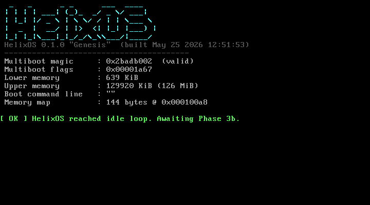
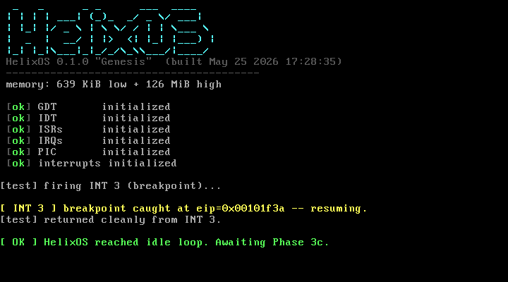
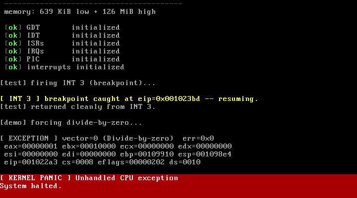
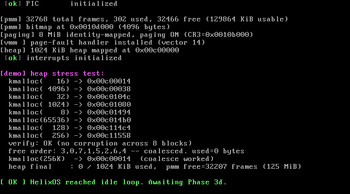
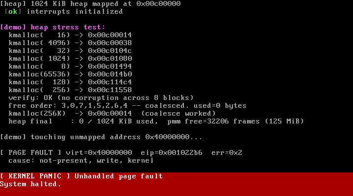
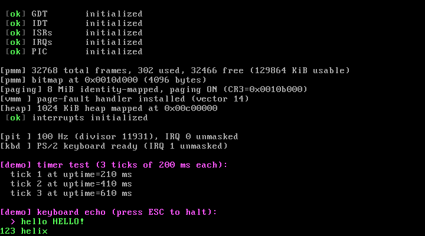
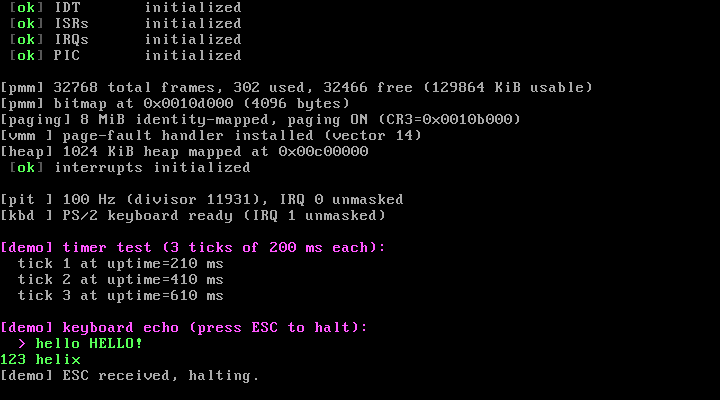
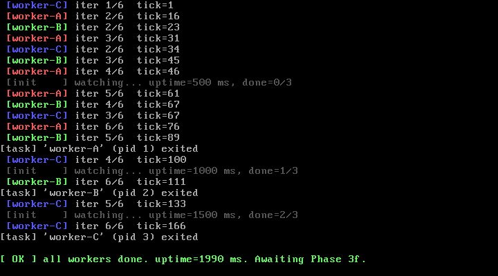
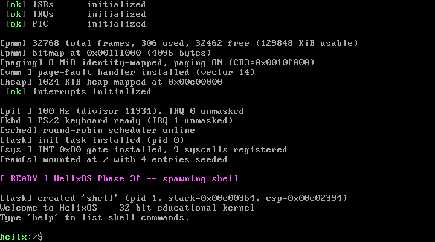
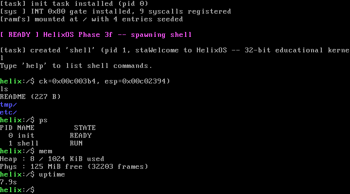

# Screenshot Gallery

A visual history of each development phase. Every image is a real QEMU framebuffer dump (no edits).

## Phase 3a — Boot + console

GRUB hands control to the kernel; the VGA driver prints the banner. No interrupts, no memory management — just `kprintf` working over serial + VGA. This is the smallest possible "alive" kernel.

## Phase 3b — CPU init + exceptions

<table>
<tr>
<td></td>
<td></td>
</tr>
</table>

GDT, IDT, ISRs, and PIC all installed. Left: clean boot through the new init stages. Right: a deliberate `int $0` triggers the divide-by-zero exception handler and produces a register-dumping panic banner.

## Phase 3c — Memory

<table>
<tr>
<td></td>
<td></td>
</tr>
</table>

PMM bitmap allocates frames; paging is enabled and 8 MiB is identity-mapped; the VMM exposes a region allocator; `kmalloc`/`kfree` work. Left: heap self-test passes 8 allocations with byte patterns. Right: deliberate access to an unmapped address produces a decoded page-fault banner showing CR2, error code, and faulting EIP.

## Phase 3d — Drivers

<table>
<tr>
<td></td>
<td></td>
</tr>
</table>

PIT at 100 Hz + PS/2 keyboard via IRQ 1. The kernel echoes typed characters back to the screen. The "final" screenshot shows the uptime counter incrementing live.

## Phase 3e — Multitasking

Three worker tasks (`worker-A`, `worker-B`, `worker-C`) printing iteration counters in different colors, each sleeping a different interval (150 / 220 / 330 ms). The `init` task is the gray narrator. Real Round-Robin preemption: workers interleave and complete in the expected wall-clock (~2 s for 6 iterations × 330 ms).

This is the screenshot that revealed two real bugs along the way:

- The first version had EFLAGS in the wrong slot of the initial task stack frame, so workers ran with IF=0 and never preempted — 18 iterations in 30 ms instead of 2 s. ([ADR-0006](../design/adr/0006-context-switch-frame-layout.md))
- A shadowed `static current` in two files meant exit messages all said "init" instead of the actual worker name.

## Phase 3f — Shell

<table>
<tr>
<td></td>
<td></td>
</tr>
</table>

The full system. Left: boot completes through every subsystem (paging, scheduler, syscalls, RAMFS) and spawns the shell, which prints `/etc/motd` and the `helix:/$` prompt. Right: interactive session running `ls` (blue directory names!), `ps` (live task table), `mem` (heap + frame stats), and `uptime` — all routed through `INT 0x80` syscalls.

This is what gets demoed.

The keystroke-injection test path also uncovered the **EOI-before-handler** bug: when the PIT IRQ context-switched mid-handler, the PIC was left thinking IRQ 0 was still in service, which (by 8259 priority rules) silently blocked IRQ 1 (keyboard). Fixed in `irq_dispatch` and documented in [ADR-0005](../design/adr/0005-eoi-before-handler.md).
